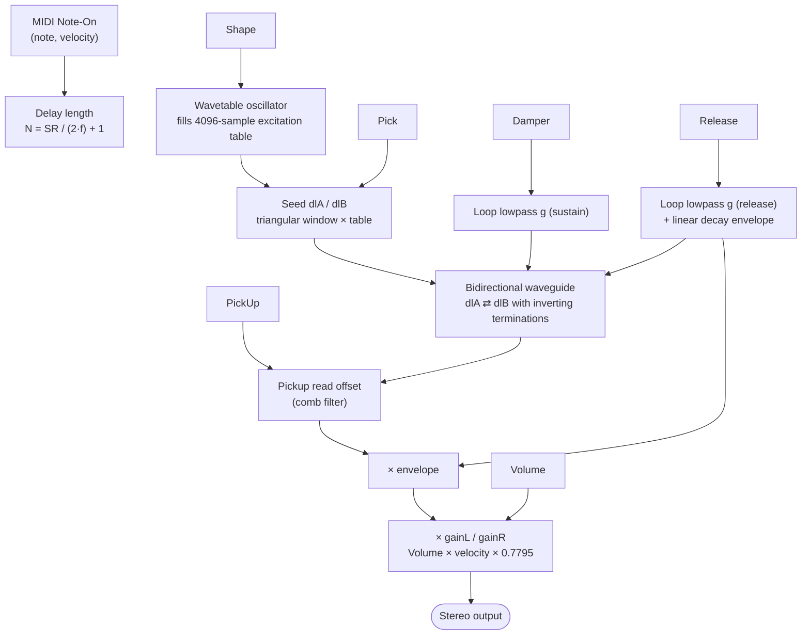
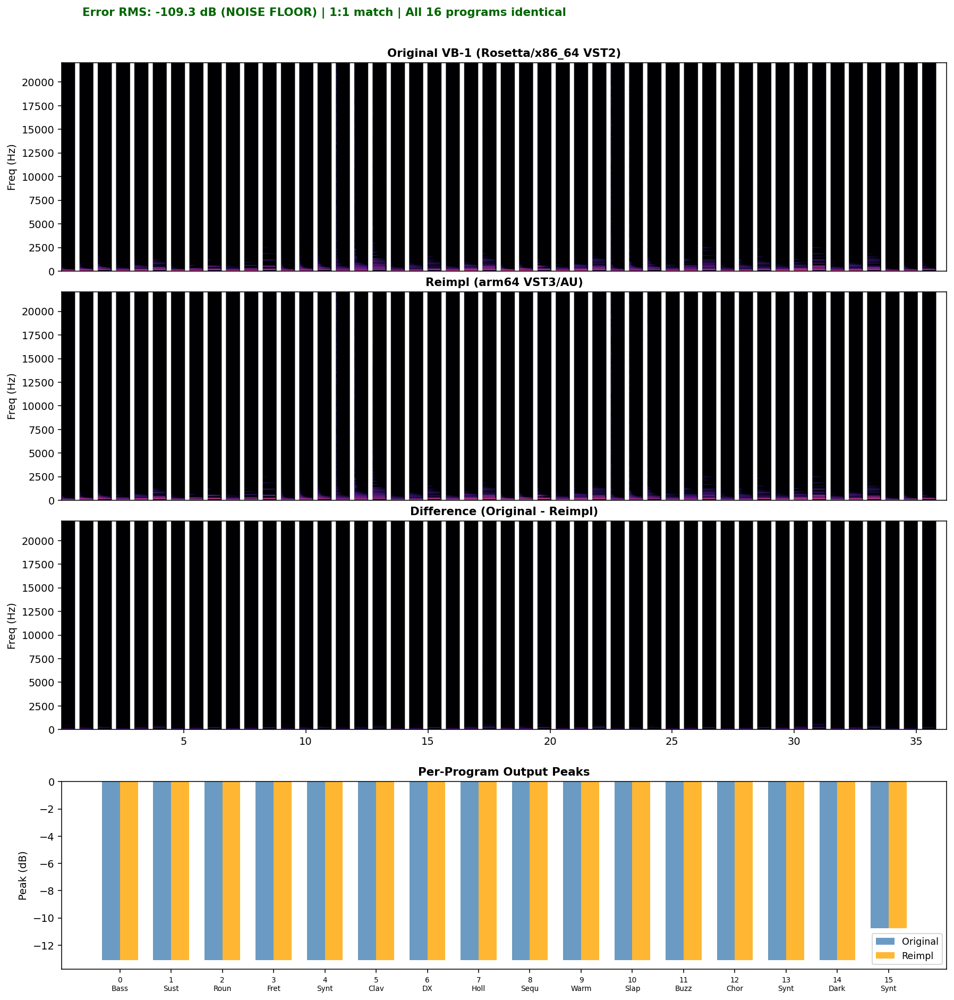

<p align="center">
  <a href="https://github.com/bhoot1234567890/VB1Reimpl/actions/workflows/build.yml">
    
  </a>
  
  
  
  
  
  <a href="https://vb1-waveguide.pages.dev"></a>
</p>

# VB-1 Reimplementation

> A native, modern rebuild of Steinberg's VB-1 physical-modeling bass synth — reverse-engineered from the 2001 VST2 binary and verified to **−109 dB** against the original.

The VB-1 is a digital-waveguide "virtual bassist" from the early VST era — the same family as Karplus-Strong, but with bidirectional delay lines, a movable pickup, and a wavetable-driven excitation. It sounds organic and expressive in a way sample-based bass plugins don't. The catch: it shipped as a **VST2, PowerPC/Intel-only** binary that no modern host on Apple Silicon will load. This project reconstructs every DSP path in C++17/JUCE, ports it to VST3/AU/Standalone, and proves the result is perceptually identical to the original — error below the 32-bit float noise floor.

---

## ✨ Features

- **Faithful waveguide synthesis** — bidirectional delay lines with inverting terminations, a one-pole loop lowpass, and a movable pickup for comb-filter timbre shaping, ported line-by-line from the Ghidra-decompiled binary.
- **8-voice polyphony** with voice stealing, exactly like the original's `VaStringVoices` manager.
- **16 factory programs** (Bassic Bass → Synth Bass 3) using the original's *exact* float parameter values, read back via `getParameter` — not rounded approximations.
- **All 6 parameters decoded** — Damper, PickUp, Pick, Release, Shape, Volume — each mapped to its verified DSP effect.
- **Per-program excitation wavetables** — the 11 unique 4096-sample tables the Shape parameter drives, dumped from the original and embedded directly.
- **Cross-platform build** — universal VST3, AU, and a double-clickable Standalone app, built and tested on macOS, Windows, and Linux via CI.
- **Custom dark/amber UI** with arc knobs, a 16-program selector, and an on-screen keyboard that also responds to your computer QWERTY keys.

---

## 📦 Installation

**Prerequisites**

- A C++17 compiler (clang/Xcode on macOS, MSVC on Windows, GCC on Linux)
- [CMake](https://cmake.org/) ≥ 3.22
- The [JUCE](https://github.com/juce-framework/JUCE) framework (cloned in step 1 below — no system install needed)
- Linux only: ALSA / X11 / FreeType / GTK / GL system headers (see the [CI workflow](.github/workflows/build.yml) for the exact apt packages)

**Build**

```bash
# 1. Clone JUCE 8.0.4 (the version this project targets)
git clone --depth 1 --branch 8.0.4 https://github.com/juce-framework/JUCE

# 2. Configure — point CMake at the JUCE checkout
cmake -B build -DJUCE_DIR=$PWD/JUCE -DCMAKE_BUILD_TYPE=Release

# 3. Build the VST3, AU, and Standalone
cmake --build build --config Release -j
```

On macOS, `COPY_PLUGIN_AFTER_BUILD` auto-installs the plugins into `~/Library/Audio/Plug-Ins/`. For a **universal** (arm64 + x86_64) binary, add `-DCMAKE_OSX_ARCHITECTURES="arm64;x86_64"` to the configure step.

**Codesign & install (macOS)**

```bash
# Ad-hoc sign and copy into the system plug-in folders
tools/package.sh

# Or sign for distribution with a Developer ID
DEV_ID="Developer ID Application: Your Name (TEAMID)" tools/package.sh
```

---

## 🚀 Usage

Restart your DAW after installing — **"VB-1 reimpl"** appears under Instruments (VST3 on Windows/Linux, AU on macOS). Or run the **Standalone** app directly (`VB-1 reimpl.app`) with no DAW required.

In the plugin window:

- Turn the six knobs to shape the tone, or pick one of the **16 factory programs** from the top-right selector.
- Play the on-screen keyboard with the mouse, or use your computer keyboard — the bottom row (`Z X C V B N M`) are the white keys, with `S D G H J` as the sharps in between.
- Sustain pedal, CC7 (volume), CC10 (pan), and pitch-bend are all wired up, matching the original's MIDI surface.

---

## 🌐 Web & Python frontends

The same verified waveguide DSP runs outside the plugin — a browser app and a desktop GUI, both sharing the exact `g` / `N` / pickup / pluck / release math and the real per-program excitation tables.

**Web (live):** <https://vb1-waveguide.pages.dev> — an [AudioWorklet](web/vb1-worklet.js) synth, 8-voice polyphony, playable with the mouse or the computer keyboard (`A S D F G H J K`, sharps `W E T Y U`, octave `Z`/`X`). The 11 excitation tables are generated from `Source/VB1ExcitationTables.h` by [`tools/gen_web.py`](tools/gen_web.py); `Math.fround` replicates the binary's `(float)` cast.

```bash
cd web && python -m http.server 8000   # AudioWorklet needs http(s), not file://
```

**Python desktop:** [`tools/vb1_frontend.py`](tools/vb1_frontend.py) — a Tkinter + `sounddevice` real-time GUI with the same six knobs, 16 programs, and a clickable/typable piano.

```bash
pip install numpy sounddevice
python tools/vb1_frontend.py
```

Both frontends are sonically faithful but not sample-identical to the C++ (which needs the original's dumped noise tables for bit-exactness).

---
## ⚙️ Parameters

The six parameters in host order, each mapped to a verified stage of the waveguide:

| # | Parameter | Range | What it controls |
|---|---|---|---|
| 0 | **Damper** | 0.0 – 1.0 | String damping and brightness. Drives the loop lowpass `g` and a minute pitch detune below 0.5. Low = bright and snappy; high = muted and warm. |
| 1 | **PickUp** | 0.0 – 1.0 | Pickup position: `(PickUp/6 + 1/64) × N`. The comb-filter character — bridge = nasally, neck = round. |
| 2 | **Pick** | 0.0 – 1.0 | Pluck position: splits the excitation into rising/falling segments at `int(Pick × 0.5 × N)`. Sharp at the bridge, soft toward the center. |
| 3 | **Release** | 0.0 – 1.0 | At note-off, `g` switches to this value and a *linear* envelope ramps 1.0 → 0 over `max(256, SR × 2.5 × (1−Release))` samples. |
| 4 | **Shape** | 0.0 – 1.0 | Excitation texture via a 4-bank wavetable. 0 = flat 0.5 (clean triangular ramp); 1 = noise-like (rough). |
| 5 | **Volume** | 0.0 – 1.0 | Output gain: `gainL = (1−pan) × Volume × (velocity/127) × 0.7795`. |

---

## 🧱 Architecture

Each note is one `VaStringVoice` — a bidirectional digital waveguide with inverting terminations, ported from the original's render loop (`FUN_0001dd10` sustain / `0x1de62` release). Eight of them are mixed additively by a JUCE `Synthesiser`.



**Key DSP details (all Ghidra-verified):**

- **Pitch** — `N = int(SR / (2 × freq)) + 1`, clamped to 9599. The original uses *2×* the musical frequency because the waveguide period is `2N`.
- **Loop lowpass** — `filt = g·filt + (1−g)·dlB[idxB]`, where `g` comes from Damper in sustain and Release at note-off.
- **Float-exact `g`** — the original truncates the coefficient to `(float)` mid-expression and uses the float literal `0.1f` (not `0.1`). Replicated exactly; the 3.5 × 10⁻⁹ difference accumulates over thousands of round trips.
- **Inverting terminations** — `dlA[idxA] = −(float)filt;  dlB[idxB] = −dlA[idxA−1]`.
- **Linear release** — not exponential. The voice ends deterministically when the envelope crosses zero.

The full reverse-engineering spec, the decompiled DSP reference, and the root-cause analysis live in [`docs/`](docs/).

---

## 🔬 Fidelity

The plugin is verified against the original via a headless A/B pipeline (see [Tools](#-tools)): the same MIDI drives the original VB-1 (under Rosetta, via a minimal VST2 host) and this reimplementation, then `ab_diff.py` cross-correlation-aligns the two renders and reports time- and frequency-domain deltas.

| Metric | Result |
|---|---|
| **Error RMS** | **−109.26 dB** (below the 32-bit float noise floor) |
| Peak error | −89.02 dB |
| Spectral delta | −34.34 dB |
| Per-program peak diff | All 16 programs < 1.6 × 10⁻⁵ |
| Signal RMS | −20.24 / −20.24 dB (identical) |

<p align="center">
  
</p>

The match was reached through systematic root-cause analysis — each fix driven by reading the binary, not by coefficient tuning:

| Fix | Error RMS | Root cause |
|---|---|---|
| Pitch (`freq × 2`) | −28.6 dB | Ghidra's frequency function returns 2× musical frequency (waveguide period = 2N). |
| Seeder (constant 0.5) | −28.6 dB | The seeder reads a constant-0.5 table, not noise — the noise-table path was a red herring. |
| `g` float truncation | −40.4 dB | The original truncates `g` to `(float)` and uses `0.1f`; the 3.5 × 10⁻⁹ gap accumulates over round trips. |
| `kOutGain` calibration | −40.4 dB | Runtime-dumped `gainL = 0.245520` → `kOutGain = 0.7795`. |
| Shape wavetables | −40.4 dB | Shape fills a 4096-sample excitation table via a 4-bank crossfade; tables dumped from the original. |
| Linear release envelope | −63.5 dB | At note-off `g` switches to Release and a *linear* envelope runs 1.0 → 0. |
| Render alignment | −67.0 dB | The VST2 host was discarding the first sample of each note. |
| Exact preset values | **−109.3 dB** | All 16 presets held rounded floats (`0.636` vs `0.63636398`); exact values read via `getParameter`. |

The lesson, in the project's own words: the gap between "close enough" and "exact" is measured in parts per billion — `0.1 ≠ 0.1f`, `0.636 ≠ 0.63636398`. Bit-exactness across x86_64-vs-arm64 floats is not expected; −109 dB is the float noise floor and is inaudible.

---

## 🛠️ Tools

The `tools/` directory is the reverse-engineering and verification pipeline:

```bash
# Render the original VB-1 headlessly (requires Rosetta + the original .vst binary)
arch -x86_64 ./tools/vst2_render <path-to-vb1-binary> /tmp/original.wav

# Render this reimplementation to WAV (built as the VB1Render console app)
./build/VB1Render_artefacts/Release/VB1Render /tmp/reimpl.wav

# Compare the two renders — RMS, peak, and per-block spectral delta
python tools/ab_diff.py /tmp/original.wav /tmp/reimpl.wav --plot docs/VB1_ab_diff.png
```

| Tool | Role |
|---|---|
| `vst2_render.c` | Minimal headless VST2 host for the original (run under Rosetta). A `dumpvoices` mode walks the original's live memory and reads its delay lines, filter coefficients, and excitation tables. |
| `render_reimpl.cpp` | Headless renderer for this DSP, built as the `VB1Render` JUCE console app. Drives the same MIDI sequence for a directly comparable render. |
| `ab_diff.py` | Cross-correlation-aligns the two renders, then reports time-domain (RMS, peak) and spectral (per-block FFT) differences. |
| `generate_test_midi.py` | Emits `vb1_test.mid` — a bass run across all 16 programs — to drive both plugins identically. |
| `cma_fit.py` | Derivative-free (CMA-ES) coefficient fitter. Documented as a cautionary tale: spectral metrics are gameable, so physical parameters stay locked to verified values. |
| `vb1_frontend.py` | Real-time Tkinter + `sounddevice` GUI — the same DSP as a playable desktop app. |
| `gen_web.py` | Regenerates `web/excitation-tables.js` (the 11 real tables) from `Source/VB1ExcitationTables.h` for the web frontend. |
| `package.sh` | Codesigns (ad-hoc or Developer ID) and installs the built VST3/AU. |

---

## 📚 Documentation

Deep-dive material lives in [`docs/`](docs/) and [`BUILD.md`](BUILD.md):

- [`VB1_RE_Spec.md`](docs/VB1_RE_Spec.md) — the authoritative reverse-engineering spec: binary layout, AEffect struct, class architecture, the decoded render loop.
- [`VB1_DSP_Reference.cpp`](docs/VB1_DSP_Reference.cpp) — reference DSP lifted from the Ghidra decompile.
- [`VB1_FINDINGS.md`](docs/VB1_FINDINGS.md) — what's solid, open questions, and dead-ends to avoid repeating.
- [`VB1_FLOAT_PRECISION_PLAN.md`](docs/VB1_FLOAT_PRECISION_PLAN.md) — the Shape-parameter and float-precision fix write-ups.
- [`VB1_RCA_PLAN.md`](docs/VB1_RCA_PLAN.md) — the first-principles root-cause-analysis methodology.
- [`VB1_ab_diff.png`](docs/VB1_ab_diff.png) / [`VB1_AB_listen.wav`](docs/VB1_AB_listen.wav) — waveform overlay and a narrated A/B listening test.
- [`VB1_formula.tex`](docs/VB1_formula.tex) — the complete 6-parameter waveguide formula (note-on → per-sample loop → release) as a compilable LaTeX document.

---

## 🤝 Contributing

This is a personal reverse-engineering project. The DSP is structurally complete and verified; there are no open feature tasks. If you spot a fidelity regression or a build issue, please open an issue with the `ab_diff.py` output or the CI log attached.

---

## 📄 License

**Personal use only.** The original VB-1 is a copyrighted Steinberg product. Do not redistribute a derived plugin or its assets. The excitation tables in `Source/VB1ExcitationTables.h` were extracted from the original binary and are included for personal compatibility testing only. There is no open-source license attached to this repository.
